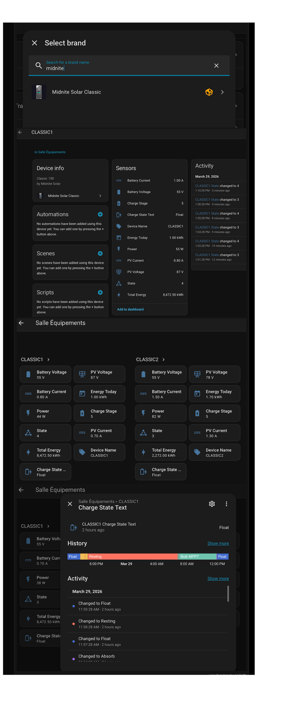

# Midnite Solar Classic — Home Assistant Integration

---

## Custom integration for **Midnite Solar Classic 150** solar charge controllers (and compatible models). Communicates with the device over **Modbus TCP**

## Features

- Periodic polling of all Classic registers via Modbus TCP
- Configurable polling interval from **10 to 3,600 seconds**
- Select which parameters to expose as HA entities via the UI
- Connection validation and automatic device name retrieval during setup
- Multi-device support (multiple Classic controllers with different IP addresses)
- Options flow (⚙️ icon) to change interval and parameter without reconfiguring
- Ability to change six registers allowing remote control of the Classic from HA

## Requirements

| Component         | Description                                                                                                                                                                        |
| ----------------- | ---------------------------------------------------------------------------------------------------------------------------------------------------------------------------------- |
| Home Assistant OS | Built on version 2026.3+                                                                                                                                                           |
| pymodbus          | Built with version ≥ 3.6.0 (installed automatically in HAOS)                                                                                                                       |
| network           | The Classic must be connected to the local network and reachable from Home Assistant.Need the address and the Classic's name must be set in the unit. See Network in user manual. |

## Installation

### 1 - Install HACS (if not allready done)

- Goto Settings → Devices & Services → Add integration
- Find HACS and follow the installation
- Login with GitHub

### 2 - Add the repository as a Custom repository

In the HACS interface:

- Click on the 3 dots on top right corner
- Select Custom repositories
- Add the repo's URL [https://github.com/qcda1/ha_midnite_classic](https://github.com/qcda1/ha_midnite_classic)
- Use Type Integration
- Click Add

### 3- Add the integration through HACS

Once the addition of the repository:

- Search for Midnite Solar Classic in HACS
- Click on "Download"
- Restart Home Assistant: Settings → System → Restart (Restart icon top right).

### 4 — Add the integration

Settings → Devices & services → **+ Add integration** → search for **Midnite Solar Classic**.

## Configuration

### Step 1 — Connection

| Field           | Description                            | Default |
| --------------- | -------------------------------------- | ------- |
| IP Address      | Classic's IP on the local network      | —       |
| Modbus TCP Port | Classic's Modbus server port           | **502** |
| Interval (s)    | Polling frequency in seconds (30–3600) | **60**  |

The integration connects immediately to validate the connection and read the device name (`Name` register).

### Step 2 — Monitored parameters

A checklist displays all parameters returned by your Classic.  
Checked by default:

`BatVoltage`, `PVVoltage`, `BatCurrent`, `EnergyToday`, `Power`, `ChargeStage`, `State`, `PVCurrent`, `TotalEnergy`, `Name`, `ChargeStateText`

## Created entities

Each selected parameter becomes a `sensor` entity with unit, device class and state class assigned automatically.

For example:

| Parameter       | Unit | Class                     |
| --------------- | ---- | ------------------------- |
| BatVoltage      | V    | voltage / measurement     |
| PVVoltage       | V    | voltage / measurement     |
| BatCurrent      | A    | current / measurement     |
| Power           | W    | power / measurement       |
| EnergyToday     | kWh  | energy / total_increasing |
| TotalEnergy     | kWh  | energy / total_increasing |
| ChargeStateText | —    | —                         |

## Six configuration entities

The integration will also create six configuration entities allowing user to change the Classic register values. This allow remote control of the Classic from Home Assistant.

| Parameter                     | Unit | Values                               | Register |
| ----------------------------- | ---- | ------------------------------------ | -------- |
| AbsorbVoltageSetPoint (Set)   | V    | See battery specs                    |  4149h   |
| FloatVoltageSetPoint (Set)    | V    | See battery specs                    |  4150h   |
| EqualizeVoltageSetPoint (Set) | A    | See battery specs                    |  4151h   |
| EqualizeTimeSetPoint (Set)    | s    | See battery specs max 4h (14400s)    |  4162h   |
| EqualizeIntervalDay (Set)     | day  | Nb days between Equalize stages      |  4163h   |
| DaysBetweenBulkAbsorb (Set)   | Days | Days between Bulk/Absorb. Skip days. |  4252h   |

Notes:
        *- Equalize Time SetPoint = 0 → Manual mode. Equalize Time SetPoint ≠ 0 enable 'EQ Auto' mode*

        *- D'ont forget that EqualizeVoltage >= AbsorbVoltage >= FloatVoltage*

        *- Refer to the Midnite Solar Classic Owner’s Manual for details about adjustments of these values.*

Details on Classic's registers are documented here → [Register map](docs/classic_register_map_Rev-C5-December-8-2013.pdf)

## Options

Click ⚙️ to change the polling interval or the monitored parameter list.  
Changes take effect immediately.

## Multiple Classic controllers

Repeat "Add integration" with a different IP address for each device.

## Troubleshooting

| Symptom              | Solution                                                                 |
| -------------------- | ------------------------------------------------------------------------ |
| "Cannot connect"     | Check IP, port, and that the Classic is powered on and reachable from HA |
| Unavailable entities | Check HA logs: Settings → System → Logs                                  |
| pymodbus error       | Restart HA — pymodbus ≥ 3.6.0 is installed automatically                 |

## License

MIT.  
Based on the work of [ClassicDIY/ClassicMQTT](https://github.com/ClassicDIY/ClassicMQTT) and [qcda1/MidniteClassic](https://github.com/qcda1/MidniteClassic).

## Config example

